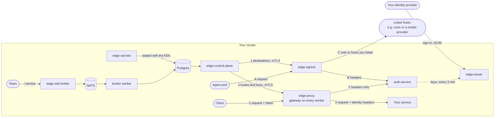

# Data flow

Where every request, key, token and answer goes in Talyvor Edge, and what leaves your cluster. The
short answer to the last question: **only the requests your agents make to hosts you listed, and
the answers your services send back to their clients.** Edge makes no call to Talyvor and sends no
telemetry anywhere you did not point it.

## A request to one of your services

1. A client sends a request to a worker's port 80 or 443. The gateway on that node matches its
   host and path to a route.
2. If the route needs a token, the gateway sends the request's **headers, path, method and source
   address** — never its body — to `auth-service` over mutually authenticated TLS. `auth-service`
   checks the token against the signing keys of the issuers you trust, which it holds in memory.
3. If the token is good, the gateway forwards the request to your service with the identity it
   proved: `x-user-id`, `x-user-email`, `x-user-teams`, and `x-gateway-auth`, an assertion signed
   with your transit key. Any of these the client sent itself is removed first. The answer goes
   back the same way.

The request body passes through the gateway to your service and is not stored. The gateway writes
one JSON access-log line per request to its own output: time, request id, method, host, path
**without its query string** (which can carry credentials), status, sizes, timing, the client's
address and user agent, the authenticated user id, and the route and backend. With tracing on it
sends the same to your OpenTelemetry collector, with a span.

## An agent calling out

- **A.** An agent whose namespace is labelled `talyvor.io/agents=true` can reach only `edge-egress`.
  It sends its call there as an HTTP proxy request.
- **B.** For a **keyless** destination, `edge-egress` sends the request's headers to
  `auth-service`, which checks the agent's own ServiceAccount token. Every credential the agent sent
  is removed, and an assertion naming the agent is added.
- **C.** `edge-egress` sends the call on only if its host is in `egress_destinations`, checking that
  host's certificate. Every decision — sent, refused, rate-limited — is written to the decision log,
  a hash chain in Postgres that you can export and verify ([agent egress](agent-egress.md#the-decision-log)).

What reaches the outside host is the agent's request, without the agent's credentials on a keyless
destination. What that host does with it is up to that host.

## Configuration

- **i.** A team registers a service with the broker, `edge-osb`, using its team key. The broker
  records the request in Postgres and queues it on NATS; a worker applies it to the route tables.
- **ii.** The control plane reads Postgres every five seconds, builds the configuration, and sends
  it to every gateway over mutually authenticated TLS. Each node is sent only the keys of the
  gateways placed on it.

## Keys and tokens

| What | Made by | Stored | Sent to |
|---|---|---|---|
| Your services' TLS keys | you, through `edge-secrets` (admin client certificate from your admin CA) | Postgres, sealed with the KEK | the gateways that serve them, over mTLS |
| The KEK | `scripts/bootstrap-pki.sh`, on your machine | Secrets in `infra`, and your offline copy | nowhere else |
| Certificates between Edge's own parts | cert-manager, from `edge-internal-ca` | Secrets in `infra` and `edge` | the part that uses them |
| Your users' tokens | `edge-issuer`, signed with its key | not stored; the client holds them | the gateway, with each request |
| Your users | your identity provider, by SCIM and OIDC sign-in, or `issuer adduser` | the `issuer` database | nowhere |
| Team keys | you | only their SHA-256, in Postgres | nowhere |
| Your licence | Talyvor | a Secret in `infra` | nowhere: it is checked offline |

## What stays in your cluster

Everything above, and: metrics (scraped by your Prometheus), logs (read by your log collector),
traces (sent to your collector), and backups (written to the S3-compatible store you name). See
[no internet at run time](no-internet-at-run-time.md) for what each service connects to.

## Lens and the answer pool

Talyvor Edge does not run Lens, the gateway that applies an agent's wallet rules — its budget,
spending rules and approvals — before a model call or payment. When you list Lens as an agent
destination, the agent's request leaves your cluster for Lens (step C), and from there Lens's
handling applies. Edge stores no prompts and no answers, and does not pool anything itself.

What Lens does with the request:

- **The model provider receives the prompt.** That is the request; the provider's own terms
  govern it.
- **Lens stores reusable answers, with the latest question for each, until you delete them** in
  Features. They do not expire. Under logging "none", nothing of a question or answer is stored.
- **The answer pool.** With sharing on — the default for a new workspace — when another company
  asks a question close enough in meaning to one your workspace asked, it may be served the answer
  that was generated for you, in full, instead of paying a provider again; and you may be served
  theirs. That is why a reused answer costs less than its list price, and why the workspace whose
  answer is reused earns from it.
  - **Prompts are not served to anyone.** Questions are matched by their hash and their embedding,
    and only the answer is sent. But an answer often restates its question, so treat it as: *the
    answer leaves the workspace*. A question's embedding is computed by OpenAI, and Anthropic checks
    pairs of questions.
  - **One click turns sharing off**, on Home and in Settings. That stops new answers being shared;
    answers shared before stay available to others, and keep earning, until you delete them in
    Features.
  - Sharing is also switched deployment-wide by Lens's operator. Where that is off, nothing pools.
- Your API keys, balance, ledger and agent wallets are never shared.

If what your agents ask is confidential, turn sharing off for that workspace before they use it.
Talyvor's [privacy policy](https://app.talyvor.com/privacy) is the full statement.
